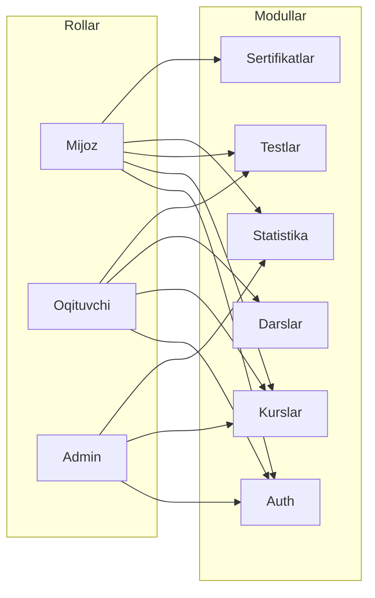

# Rollar va modul diagrammasi

Talim platformasida 3 ta asosiy rol va ular bilan bog‘liq modullar.

## Rollar

| Rol | Tavsif |
|-----|--------|
| **Mijoz (O'quvchi)** | Fan tanlash, test topshirish, kursga yozilish, progress ko‘rish, online/offline darslar |
| **O'qituvchi** | Kurs yaratish, video dars yuklash, jonli darslar, offline darslarni boshqarish, test yaratish |
| **Admin** | Foydalanuvchilarni boshqarish, kurslarni nazorat qilish, statistikani ko‘rish |

## Diagramma

## Modullar va vazifalari

- **Auth** – Ro‘yxatdan o‘tish, login, JWT, rol tekshiruvi
- **Kurslar** – Kurslar CRUD, fan bo‘yicha filter, online/offline
- **Testlar** – Savollar, topshirish, natija va daraja (Beginner/Intermediate/Advanced)
- **Darslar** – Video darslar, jonli darslar (link), offline jadval
- **Statistika** – Dashboard, progress, reyting, XP/badge
- **Sertifikatlar** – Kurs tugagach PDF sertifikat
