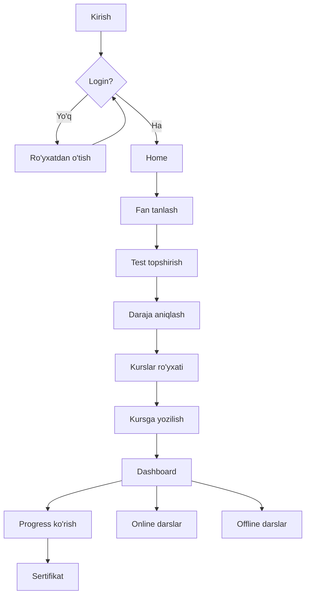
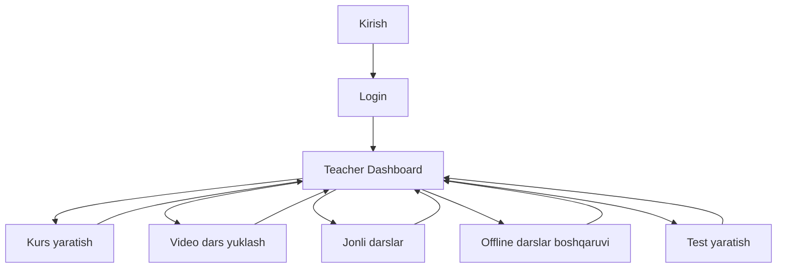
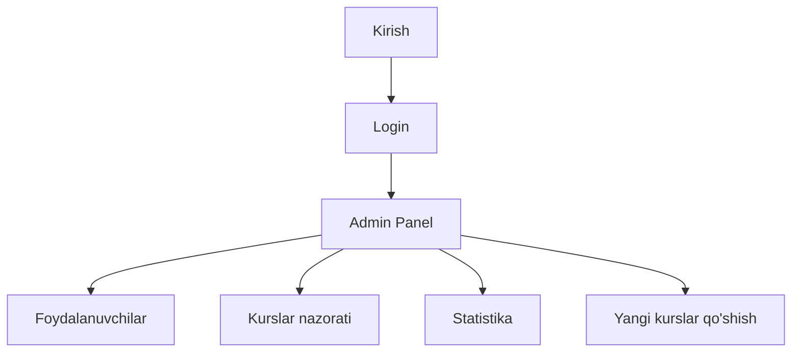

# User flow diagram

Foydalanuvchi oqimi – Mijoz (Student), O'qituvchi (Teacher) va Admin uchun.

## Mijoz (O'quvchi) oqimi

## O'qituvchi oqimi

## Admin oqimi

## Umumiy sahifa va route xulosasi

| Foydalanuvchi | Asosiy yo‘l |
|---------------|-------------|
| Student | Login → Fan tanlash → Test → Daraja → Kursga yozilish → Dashboard (progress, online/offline darslar) |
| Teacher | Login → Dashboard → Kurs yaratish / Video yuklash / Jonli darslar / Offline boshqarish / Test yaratish |
| Admin | Login → Admin Panel → Foydalanuvchilar / Kurslar / Statistika |
